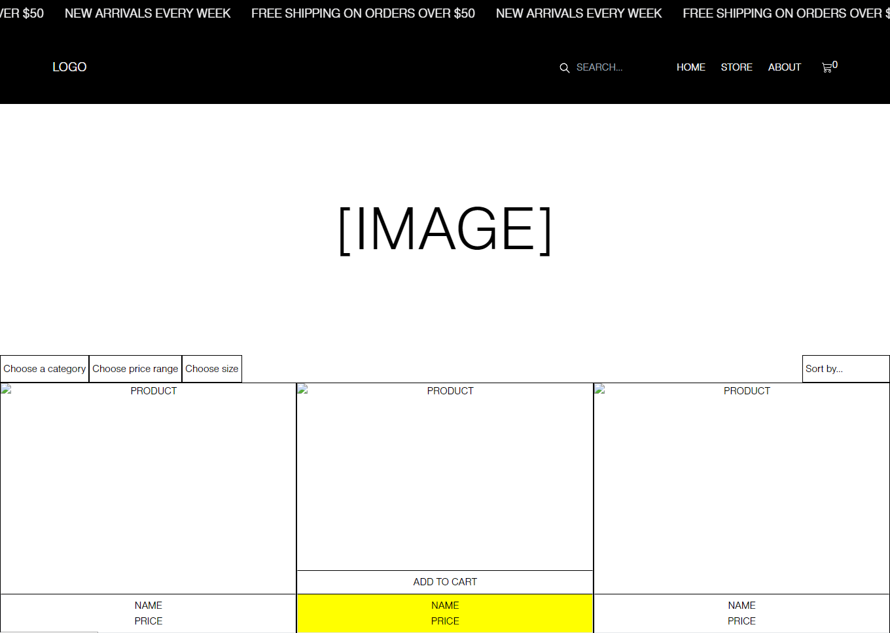

<h1 align="center" id="title">Gnomenciaga</h1>

<p id="description">This is an e-commerce store selling gnomes built with React and Tailwind CSS. Inspired by Applications in the Interpreted Languages course at TUL - refactored to make it more frontend-focused with emphasis on accessibility responsive design and current web design trends (such as neubrutalism). My own personal project to keep learning aside from studies.

[PROJECT IN PROGRESS]
</p>    


<h2>🧐 Features</h2>

Here're some of the project's best features:

*   Responsive design with Tailwind CSS
*   Dynamic page routing with React Router
*   Trendy scrolling animations with Framer Motion
*   Intuitive web layout, friendly for screen readers
*   Selecting products and viewing more information about them
*  Filtering products by categories and using search option in the navbar
*  Sorting products
* Viewing cart and removing products from it or proceeding to checkout
* Connection with backend in Firebase

<h2>💻 Built with</h2>

Technologies used in the project:

* React
* React Router
* TailwindCSS & SASS
* npm
* Framer Motion
* Firebase (backend)

<h2>🛠️ Installation Steps</h2>

To get started with this project, clone the repository and install the dependencies:

```
npm install
```

Then start the development server:

```
npm start
```
